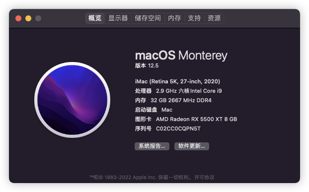

# Hackintosh-B460M-MORTAR
最适合微星迫击炮B460m的EFI，没有之一。各项补丁、驱动、配置精心调教，深度优化。因为自用，长期更新。<br>
欢迎新老朋友上车，使用愉快，enjoy~，查看最下面的<a href="#use">使用角色</a>更容易上车哦

### 功能（完善度99%）
- 支持睡眠/唤醒
- 所有USB端口定制
- 核显硬件加速
- 板载声卡
- 板载网卡
- Intel无线网卡+蓝牙
- 炫酷的MSI dragon 主题
- 各种CPU、GPU传感器齐全
- 一键重置nvram (空格）
- 双系统记忆启动（ctrl+回车)

### EFI下载与使用
[下载链接](https://github.com/leggod/Hackintosh-B460M-MORTAR/releases)，替换`EFI`-`Boot` 下的文件，和`EFI`下添加`OC`文件夹

### 硬件配置

<br>
<br>
|  配置   | 型号  |
|  ----  | ----  |
| 系统 | macos12.5和win11|
| CPU  | I5-10400 |
| 主板  | B460M 迫击炮 |
| 显卡 | XFX RX5500xt免驱|
| SSD | 西数sn720 和 美光p5|
| 无线网卡| intel ax201 支持WiFi6|

### CPU支持
- 理论支持所有10代CPU

### 显卡支持
- 支持仅有CPU核显的UHD630显卡
- 支持AMD独显 RX 470/480/570/570X/580/580X/590 系列显卡(需使用config_default.plist)
- 支持AMD独显 RX 5500/5600/5700 系列显卡(需使用config.plist)
> PS: 使用独显的需在BIOS里强制打开CPU核显（高级 -> 内建显示配置 -> 集成显卡多显示器(IGD Multi-monitor) -> 允许），否则核显硬件解码失效，只使用核显的可以忽略


### BIOS设置

* USB设备从S3/S4/S5唤醒：允许
* PS/2鼠标从S3/S4/S5唤醒：允许
* USB键盘从S3/S4/S5唤醒：任意键
* 集成显卡多显示器：允许（否则核显硬件解码失效，只使用核显的可以忽略）
* OC -> CPU 特征 -> Intel 虚拟化技术：允许
* OC -> CPU 特征 -> Intel VT-D 技术：禁止
* OC -> CPU 特征 -> CFG锁定：禁止


### 系统安装
* 建议使用 【黑果小兵】macOS 安装镜像进行安装

* 若安装镜像卡加号或其它异常无法安装，可使用本EFI替换安装镜像的EFI进行尝试
(本EFI请使用config_install.plist配置文件，即删除原config.plist后重命名config_install.plist为config.plist即可)

* 系统安装成功后，替换为本EFI默认的config.plist文件即可


### 板载网卡设置
* 系统偏好设置 -> 网络 -> 以太网（高级） -> 硬件 -> 配置:手动, 速度:100baseTX(千兆网络环境可选择1000baseT), 双工:全双工, MTU:标准1500

### 无线网卡和蓝牙设置
* 如果是 Intel 无线网卡，可以不修改Kernel-add
* 如果是 博通 无线网卡，在 Kernel-add 删除或者Enabled:false，带有intel字样的项目

### 关于睡眠的问题
* BIOS默认关闭了USB唤醒，睡眠后需按电源键唤醒
* 需鼠标键盘唤醒的，在BIOS里设置USB唤醒为允许即可
> PS: 若睡眠有问题的可使用 Hackintool 工具，切换到电源选项，点击下面的螺丝刀图标修复

### 关于Mac序列号的问题
* 下载 OpenCore Configurator for Mac，打开 PlatformInfo -> Model Lookup | Check Coverage 右侧选择 iMac20,1 机型（生成你的唯一硬件UUID），然后 Save as (另存为) config.plist
* 在config.plist文件中找到如下代码，记录MLB、SystemSerialNumber和SystemUUID的值并记住它，更新EFI时，用你记录的值替换 /OC/config.plist 下对应的值即可
> PS: 还可使用 Hackintool 工具（系统 -> 序列号生成器）来获取三码

```
<key>PlatformInfo</key>
<dict>
    <key>Generic</key>
    <dict>
        <key>AdviseWindows</key>
        <false/>
        <key>MLB</key>
        <string>C02047501CDPHCDAD</string>
        <key>ProcessorType</key>
        <integer>4105</integer>
        <key>ROM</key>
        <data>ESIzRFVm</data>
        <key>SpoofVendor</key>
        <true/>
        <key>SystemMemoryStatus</key>
        <string>Auto</string>
        <key>SystemProductName</key>
        <string>iMac20,1</string>
        <key>SystemSerialNumber</key>
        <string>C02DQSZFPN5T</string>
        <key>SystemUUID</key>
        <string>C567A1A9-9233-4D4D-B021-E1F38B112F33</string>
    </dict>
```

### Win+Mac双系统解决Win系统时间时差问题
* 在Windows下运行
```
Reg add HKLM\SYSTEM\CurrentControlSet\Control\TimeZoneInformation /v RealTimeIsUniversal /t REG_DWORD /d 1
```

### 设置默认启动项
* 在启动选择界面，先选中要启动的项，然后按键盘的 Ctrl + Enter (回车键) 进入系统，下次重启后默认就选中该项了

### 其他问题
- 安装
    - 推荐使用黑果小兵的clover 或者 oc 安装
- efi问题
    - 理论支持所有10代CPU，如果无法使用，可以尝试删除`NVRAM`-`Add`-`7C436110-AB2A-4BBB-A880-FE41995C9F82`-`boot-args` 里面的参数
    - RX 5000 和 6000 系列，一定要`boot-args`中添加 `agdpmod=pikera`，否则黑屏（不是我说的，文档写的）
- 非AMD显卡，即仅核显同学，请删掉`config.plist`-`Kernel`-`Add`-`RadeonSensor.kext`和`SMCRadeonGPU.kext` 这两项

## <a id="use">使用角色</a>
- 迫击炮b460m + Intel 10代CPU + AMD 5000~6000 系显卡 + Intel 无线网卡与蓝牙，不需要动任何配置可直接使用
- 迫击炮b460m + Intal 10代CPU + AMD 5000~6000 系显卡 + BCM 无线网卡与蓝牙（非白卡），删 `Kernel`-`add` 中 所有相关Intel选项的项目，同时勾选Brcm相关选项的 Enabled = true
- 迫击炮b460m + Intal 10代CPU + AMD 5000~6000 系显卡 + BCM 白卡，删 `Kernel`-`add` 中 所有相关Intel选项的项目或者Enabled = false
- 迫击炮b460m + Intal 10代CPU + 核显，删完`NVRAM`-`Add`-`7C436110-AB2A-4BBB-A880-FE41995C9F82`-`boot-args`里的参数

